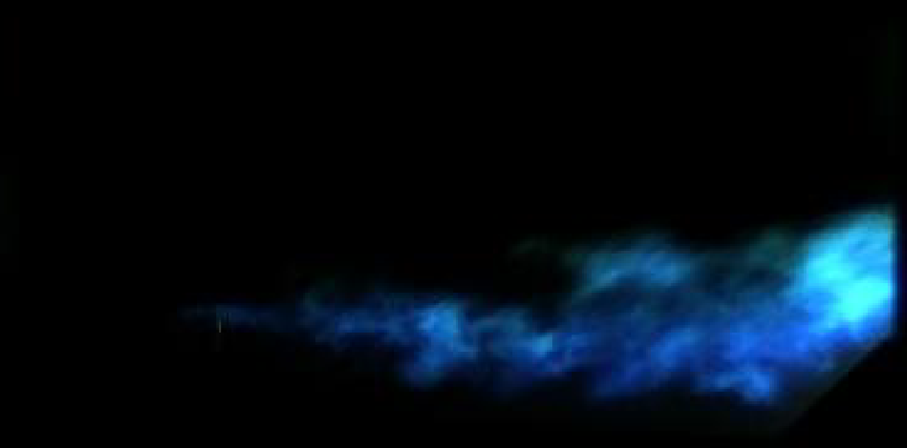

# Computer_vision--imageoverlay

# Image Overlay
This script merges Schlieren images and flame chemiluminescence images from a laser ignition and spark discharge ignition in a cavity-based supersonic combustor. The schlieren flow is non-reactive and does not show the flame that is captured in the chemiluminescence images. The goal of this program is to outline the flame in the chemiluminescence images and superimpose that contour onto the Schlieren images for analysis.  

First the flame images are processed in three steps: 
        1) splits image into RGB, 
        2) Resize the image to match the schlieren 
        3) transforms the flame image into the same perspective of the schlieren image'''
The final image is shown below.  
  

The pixels in the image are then classified into flame and no flame using an user specified threshold. The contour of the flame can then be superimposed onto the corresponding Schlieren image as shown below.  
  

The resulting image.  
  

# Final Video

This method is repeated for each image. The program then writes a video with each of the new images to show the flame development over the experiment. 

